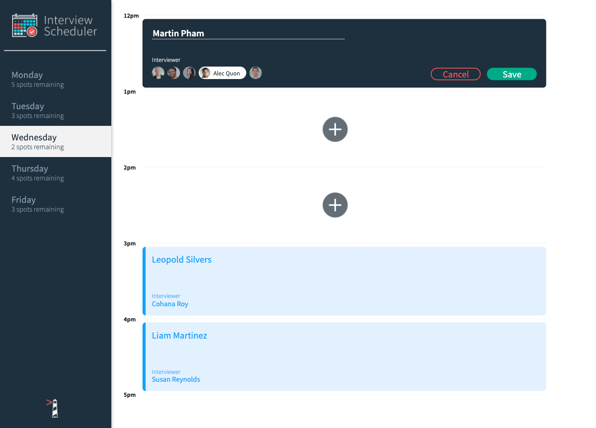
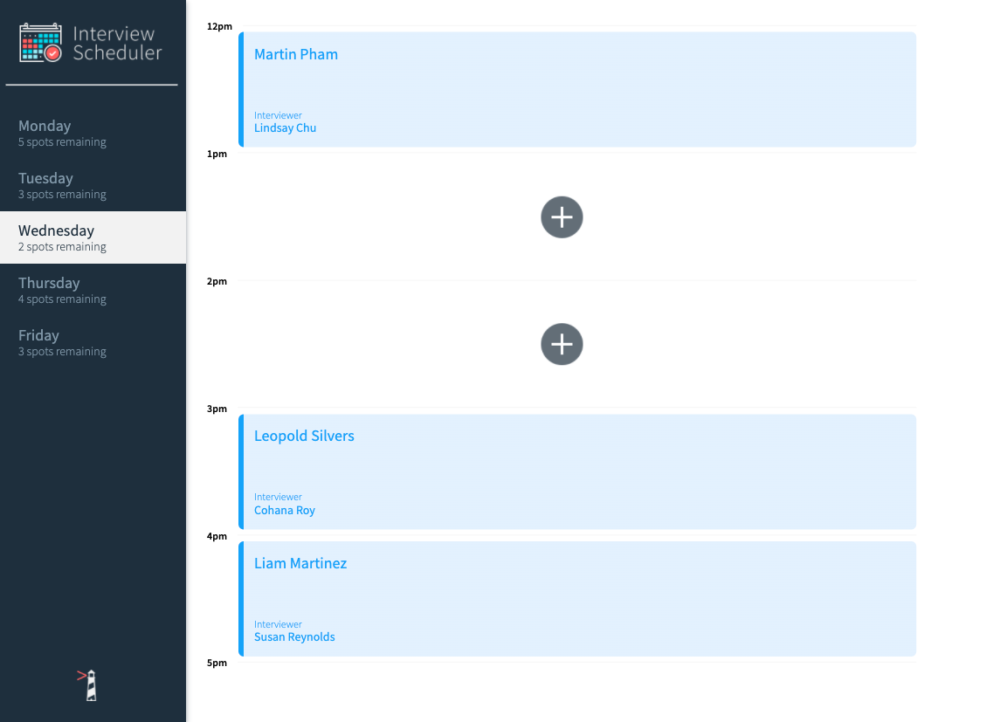
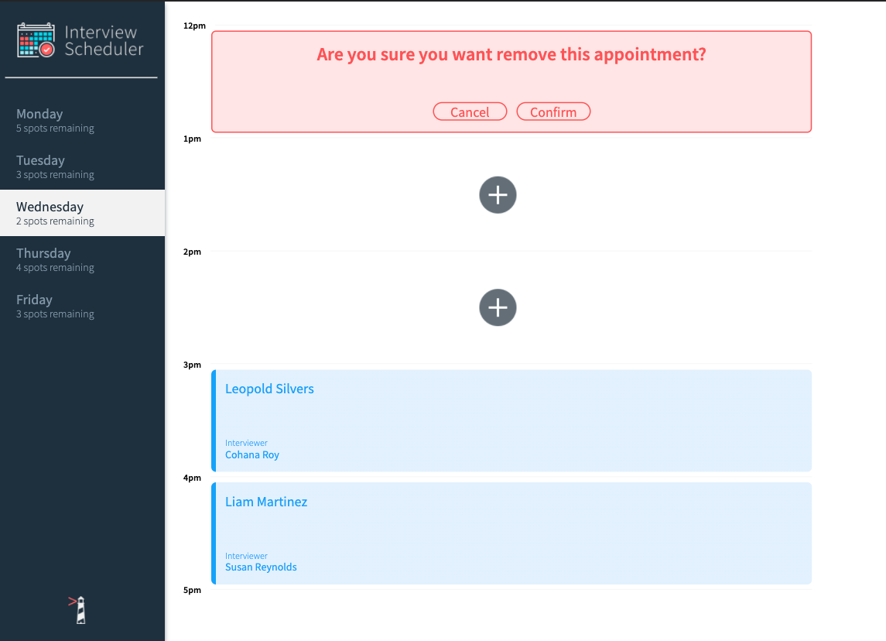
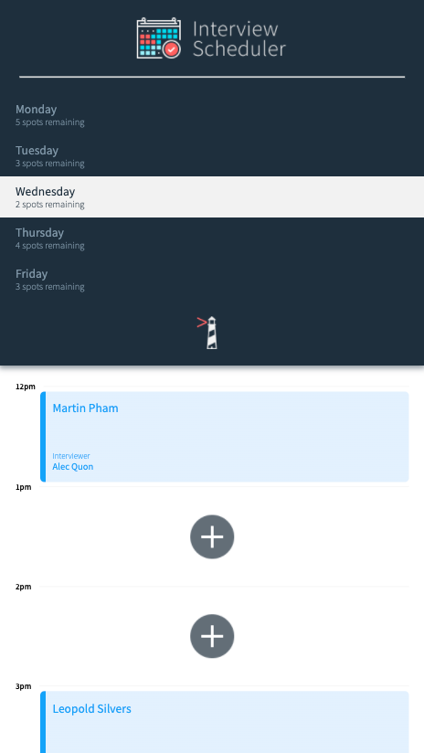

# Interview Scheduler

Built using React, Scheduler is a Single-page-app that allows users to make up to five appointments a day, and gives them the freedom of editing and deleting in real time.

## Create an Appointment
Create an appointment by entering your name and selecting an interviewer.

## Appointment Displayed
Once saved, the appointment will display, and the remaining spots on the side bar will update accordingly.

## Delete an Appointment
If needed, users are able to edit/delete their appointment. The remaining spots on the side bar will update accordingly.

## Mobile View
The app was made to be adaptive and user-friendly even in a mobile view.

----------------------------------------------------------------------------------

## Get Started

- Install all dependencies (using the `npm install` command) in the root directory.
- Get and install the [server](https://github.com/lighthouse-labs/scheduler-api).
- Run both the server and the client using `npm start` in seperate terminal windows.

## Project Stack

__Front-End:__ React, Axios, JSX, HTML, SASS, JavaScript

__Back-End:__ Express, Node.js, PostgreSQL

__Testing:__ Storybook, Webpack Dev Server, Jest, Testing Library and Cypress

## Dependencies
- "axios": "^0.25.0",
- "classnames": "^2.2.6",
- "normalize.css": "^8.0.1",
- "react": "^16.9.0",
- "react-dom": "^16.9.0",
- "react-scripts": "3.0.0"

## Dev Dependencies
- "@babel/core": "^7.4.3",
- "@storybook/addon-actions": "^5.0.10",
- "@storybook/addon-backgrounds": "^5.0.10",
- "@storybook/addon-links": "^5.0.10",
- "@storybook/addons": "^5.0.10",
- "@storybook/react": "^5.0.10",
- "@testing-library/jest-dom": "^4.0.0",
- "@testing-library/react": "^8.0.7",
- "@testing-library/react-hooks": "^7.0.2",
- "babel-loader": "^8.0.5",
- "cypress": "^9.3.1",
- "node-sass": "^4.14.0",
- "prop-types": "^15.8.1",
- "react-test-renderer": "^16.9.0"
